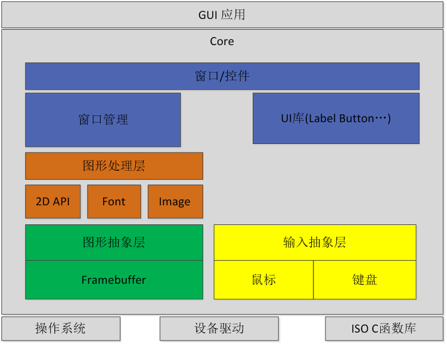

linux-gui 概要设计文档
---
##1.版本记录
| 版本 |  更新信息   | 作者  | 更新时间  |
| --- |  -------   | -----|----------|
|  1  | 创建初始版本 | xxx |2000-01-01|
|  2  |            |      |          |

##2.GUI设计
###2.1 内部组织结构

###2.2 运行模式

